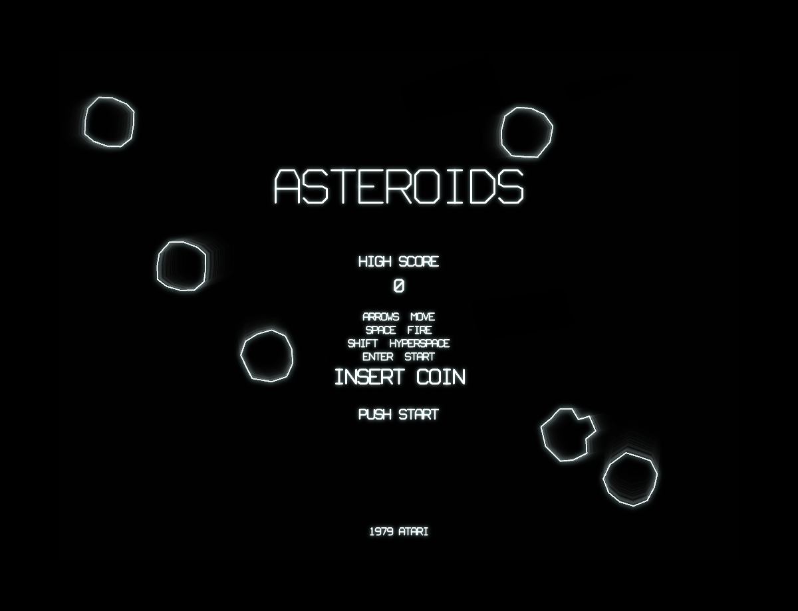
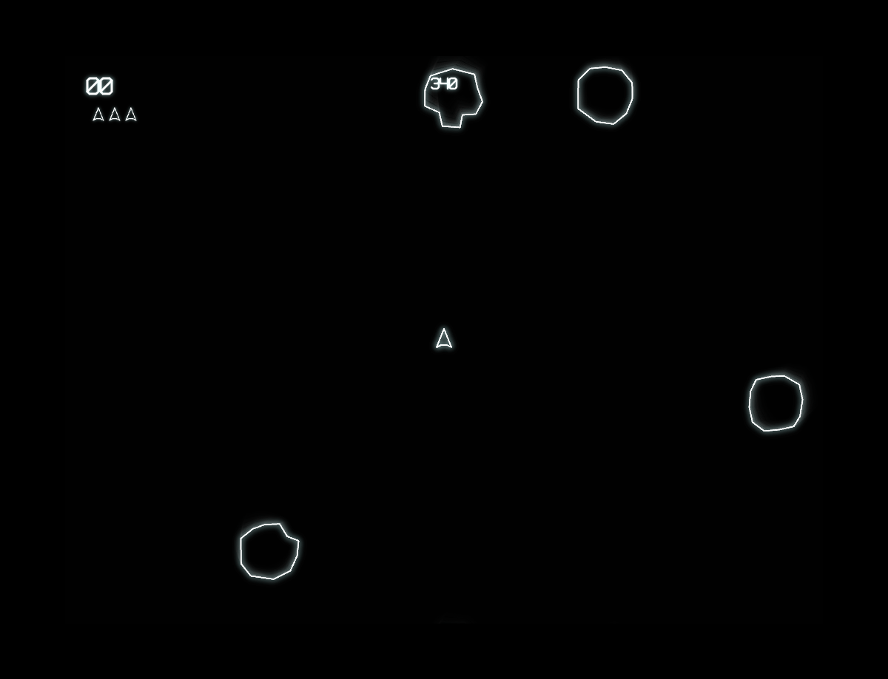

# Asteroids

A browser-based recreation of the classic 1979 Atari arcade game, built with vanilla JavaScript and HTML5 Canvas. Features authentic vector-style graphics with phosphor glow effects, faithful game mechanics, and the original scoring system.

## How to Play

Open `index.html` in any modern browser. No build step or dependencies required.

### Controls

| Key | Action |
|-----|--------|
| Arrow Keys | Rotate and thrust |
| Space | Fire |
| Shift | Hyperspace (random teleport, with a chance of exploding) |
| Enter | Start game |

## Features

- Vector-style rendering with CRT phosphor glow and vignette effects
- Three asteroid sizes that split on destruction (large, medium, small)
- Large and small UFOs with increasingly aggressive AI
- Hyperspace escape mechanic with 28% self-destruct risk
- Extra life every 10,000 points
- Progressive difficulty: more asteroids per wave, faster UFO spawns
- Attract mode with drifting asteroids
- Persistent high score (per session)

## Game History

Asteroids was created by **Lyle Rains** and **Ed Logg** and released by **Atari, Inc.** in November 1979. It became one of the most iconic and commercially successful arcade games of the golden age.

### Origins

The game drew inspiration from earlier titles: *Spacewar!* (1962), one of the earliest video games ever made, and Atari's own *Space Invaders* competitor ambitions. Ed Logg, who had previously worked on *Super Breakout*, developed the core gameplay around a simple concept — a lone ship surrounded by tumbling rocks in deep space.

### The Hardware

Asteroids ran on custom hardware built around a **MOS 6502 processor** (the same CPU family as the Apple II and Commodore 64). Uniquely, it used a **vector display** rather than the raster screens common in most arcade games. Instead of drawing pixels on a grid, the monitor's electron beam traced lines directly between coordinates, producing the sharp, glowing wireframe aesthetic that became the game's visual signature.

### Arcade Phenomenon

Asteroids was a massive hit. It **overtook Space Invaders** as the highest-grossing arcade game in the United States and became Atari's best-selling coin-op of all time, with over **70,000 cabinets** produced. Arcade operators reportedly had to install larger coin boxes to keep up with demand.

The game introduced several mechanics that became genre staples:
- **Screen wrapping** — objects leaving one edge reappear on the opposite side
- **Inertial physics** — the ship drifts realistically in zero gravity
- **Risk/reward mechanics** — smaller asteroids are worth more points but are harder to hit; hyperspace can save you or kill you

### Legacy

Asteroids has been ported to virtually every platform imaginable, from the Atari 2600 and 7800 to modern web browsers. It influenced countless space shooters and remains a foundational reference point in game design. The game was inducted into the **World Video Game Hall of Fame** in 2017.

Ed Logg went on to create *Centipede* (1981) and *Gauntlet* (1985), cementing his place as one of the most important game designers of the arcade era.

## Technical Details

This implementation is a single-file JavaScript game (`game.js`, ~1500 lines) organized into clearly separated sections:

1. **CONFIG** — All tunable constants (physics, scoring, timing)
2. **Math Utilities** — Vector math and collision helpers
3. **Entity Classes** — Ship, Asteroid, Bullet, UFO, Particle
4. **Input Handling** — Keyboard state management
5. **Collision System** — Circle-based hit detection with screen wrapping
6. **Audio Engine** — Procedural sound effects using the Web Audio API
7. **Renderer** — Vector-style drawing with glow/phosphor post-processing
8. **Game State Machine** — Attract, playing, respawn, and game-over states

No external libraries or frameworks. Just HTML, CSS, JavaScript, and the Canvas and Web Audio APIs.

## License

This is a fan recreation for educational purposes. Asteroids is a trademark of Atari.
