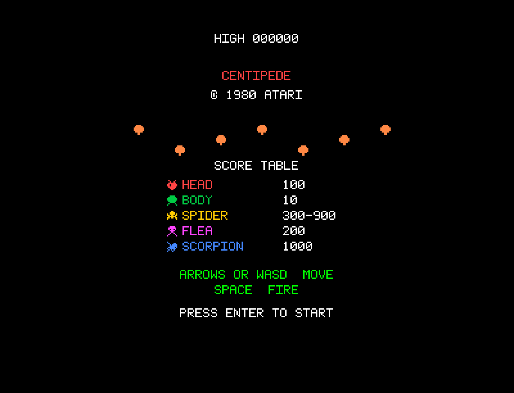
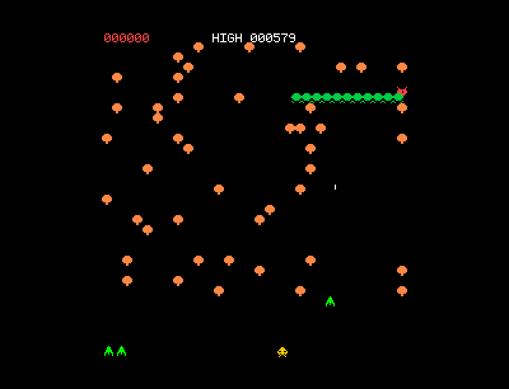

# Centipede

A browser-based recreation of the classic 1980 Atari arcade game, built with vanilla JavaScript and HTML5 Canvas. Features tile-based mushroom field mechanics, authentic centipede splitting behavior, multiple enemy types with distinct AI patterns, and the original 12-wave cycle structure.

## How to Play

Open `index.html` in any modern browser. No build step or dependencies required.

### Controls

| Key | Action |
|-----|--------|
| Arrow Keys (or WASD) | Move in 4 directions |
| Space | Fire (one bullet at a time) |
| Enter | Start game |

## Features

- 12-wave cycle: centipede starts as one 12-segment chain, progressively replaced by independent heads each wave
- Centipede splitting: shooting a body segment creates two independent centipedes and leaves a mushroom behind
- 4-hit mushroom destruction with visual damage states
- Poisoned mushrooms (from scorpion) cause centipede to dive vertically to the bottom
- Mushroom field restoration at wave end (5 points per restored mushroom)
- Spider with proximity-based scoring: 300 (far), 600 (medium), 900 (close)
- Flea drops vertically when mushrooms thin out, leaves new mushrooms behind, takes 2 hits (speeds up after first)
- Scorpion traverses horizontally, poisoning mushrooms it touches
- Flea/scorpion mutual exclusion (can't both be on screen)
- Player confined to bottom 6 rows with mushroom collision
- Progressive difficulty: centipede, spider, and flea speed up as score increases
- Extra life every 12,000 points (max 6 lives)
- Attract screen with score table and control instructions
- Persistent high score via localStorage
- Procedural audio: all sound effects synthesized via Web Audio API

## Game History

Centipede was designed by **Ed Logg** and **Dona Bailey** and released by **Atari** in 1980. It holds a special place in gaming history as one of the first major arcade games co-designed by a woman, and it became one of the first arcade titles to attract a significant female audience.

### Origins

The game concept began with Ed Logg's idea of a multi-segmented creature that would split when shot. Dona Bailey, one of Atari's few female engineers at the time, was attracted to the project partly because of its pastel color palette — unusual for the era's mostly dark-toned games. The trackball controller was chosen to give players precise 4-directional movement in the confined bottom area, differentiating Centipede from the left-right-only shooters that dominated arcades.

### The Hardware

The game ran on a **MOS 6502 processor** at 1.512 MHz — the same CPU family used in the Apple II and Atari 2600. The display was a **256x240 raster** in portrait orientation, with a tile-based rendering system using an **8x8 pixel grid** (30 columns x 32 rows). Sound came from Atari's custom **POKEY chip**, providing 4 channels of distinctive synthesized audio. The graphics used a 2-bits-per-pixel color system allowing 4 colors per tile from a palette of 16.

### Arcade Phenomenon

Centipede was a massive commercial success, earning over **$115 million** in its first year. It was one of the top-grossing arcade games of 1981-1982 and became Atari's best-selling coin-op game. The game's appeal was remarkably broad — surveys at the time found that roughly **60% of Centipede players were female**, a dramatic contrast to the heavily male-skewed demographics of other arcade games. This crossover appeal was attributed to the game's colorful aesthetics, the satisfying feel of the trackball controls, and the strategic (rather than twitch-reflex) gameplay.

The game established several design innovations:
- **Persistent battlefield** — mushrooms accumulate across play, creating an evolving obstacle landscape
- **Enemy ecology** — four distinct enemy types (centipede, spider, flea, scorpion) that interact with the environment differently
- **Risk/reward positioning** — closer proximity to enemies means higher scores but greater danger
- **Wave structure** — the 12-wave cycle created natural difficulty progression without simply making things faster

### Legacy

Centipede spawned a sequel, *Millipede* (1982), and has been ported to dozens of platforms from the Atari 2600 to modern mobile devices. The game influenced the "bug shooter" sub-genre and demonstrated that arcade games could appeal to audiences beyond the traditional young male demographic. Dona Bailey's contribution is celebrated as a landmark moment for women in game development. The game was inducted into the **World Video Game Hall of Fame** in 2020, exactly 40 years after its release.

## Technical Details

This implementation is a single-file JavaScript game (`game.js`, ~2340 lines) organized into clearly separated sections:

1. **CONFIG** — All tunable constants (display, grid, scoring, timing, colors)
2. **Math Utilities** — AABB collision, clamping, and grid/pixel conversion helpers
3. **Sprite Data** — Pixel-accurate 2D arrays for all game sprites, mushroom damage states, and bitmap font
4. **Sound Engine** — Procedural audio via Web Audio API (POKEY-style synthesis)
5. **Input Handler** — Keyboard state management with buffered just-pressed tracking
6. **Entity Classes** — CentipedeSegment, Spider, Flea, Scorpion, Player, Bullet
7. **Collision System** — AABB detection with grid-based mushroom checks and centipede splitting
8. **Renderer** — Scaled pixel-art rendering in 240x256 logical space at 3x magnification
9. **Game State Machine** — Attract, playing, death, wave complete, and game-over states with 12-wave cycle
10. **Main Loop** — Fixed 60Hz timestep with accumulator pattern

No external libraries or frameworks. Just HTML, CSS, JavaScript, and the Canvas and Web Audio APIs.

## License

This is a fan recreation for educational purposes. Centipede is a trademark of Atari Interactive.
