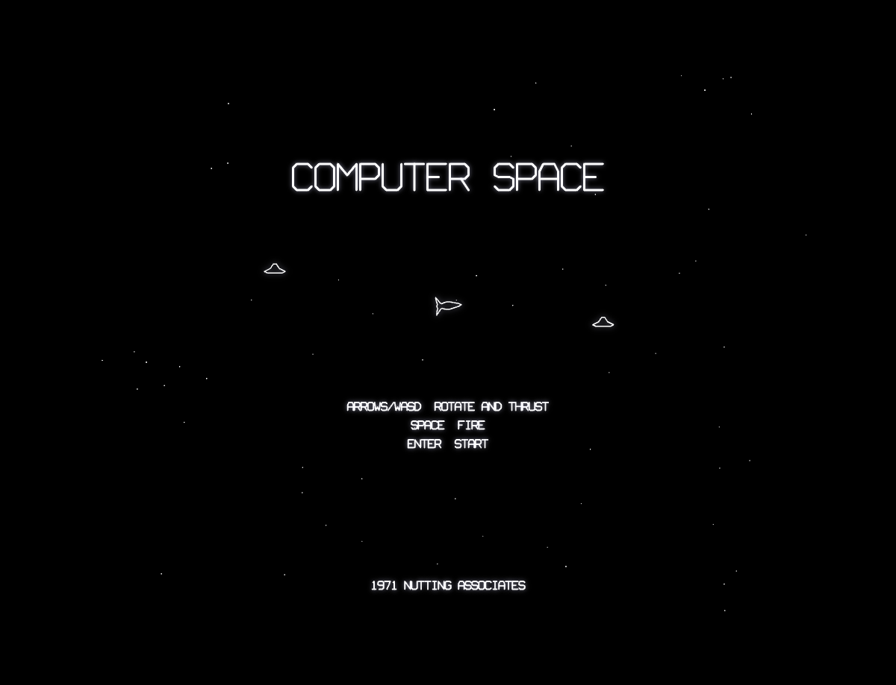
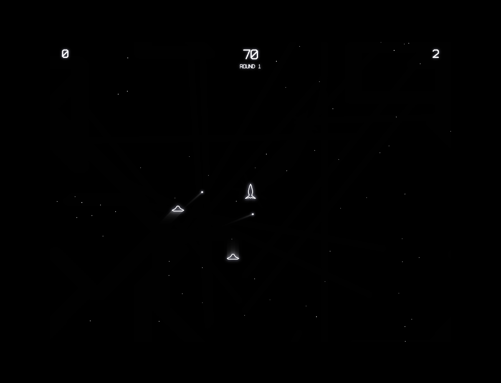

# Computer Space

A browser-based recreation of the first commercially sold coin-operated video game (1971, Nutting Associates), built with vanilla JavaScript and HTML5 Canvas. Features monochrome CRT visuals with phosphor glow and scanline effects, Newtonian physics, guided missiles, and time-based rounds faithful to the original hardware.

## How to Play

Open `index.html` in any modern browser. No build step or dependencies required.

### Controls

| Key | Action |
|-----|--------|
| Left/Right Arrows or A/D | Rotate ship (discrete 16 directions) |
| Up Arrow or W | Thrust |
| Space | Fire guided missile |
| Enter | Start game |

## Features

- Monochrome CRT rendering with phosphor persistence, scanlines, and vignette
- Discrete 16-direction rotation (22.5-degree steps) with cooldown, matching TTL hardware
- Near-frictionless Newtonian physics (drag 0.998) for authentic momentum
- Guided player missiles that gently track the ship's current heading
- Two AI-controlled saucers with 8-direction movement and quadrant-based aiming
- Time-based rounds (99-second countdown) with unlimited respawns
- Score comparison at round end: outscore the saucers for a bonus round
- Toroidal wrapping on all screen edges for all entities
- Procedural square-wave audio matching the primitive TTL sound hardware
- Attract mode with spinning rocket, drifting saucers, and starfield

## Game History

Computer Space was created by **Nolan Bushnell** and **Ted Dabney** and manufactured by **Nutting Associates** in November 1971. It holds the distinction of being the first commercially sold coin-operated video game, predating Pong by a full year.

### Origins

Bushnell was inspired by *Spacewar!* (1962), the pioneering PDP-1 game created at MIT. He wanted to bring that experience to the masses through coin-operated machines. Working with Dabney, he designed a version that could run on inexpensive hardware rather than requiring a minicomputer. The game pitted a player-controlled rocket ship against two computer-controlled flying saucers in a starfield arena.

### The Hardware

What made Computer Space remarkable from an engineering perspective was that it contained **no CPU or microprocessor** — the entire game ran on discrete TTL (transistor-transistor logic) integrated circuits. Sprites were stored as dot patterns in diode matrices, and all game logic was implemented through hardwired logic gates. The display was a standard black-and-white television set, making it one of the earliest raster-display video games (in contrast to the later vector displays used by Asteroids).

### Reception

While Computer Space was not a commercial blockbuster — its complex controls were considered too difficult for the average bar patron — it was historically pivotal. Approximately **1,500 units** were produced. The distinctive fiberglass cabinet, designed with a futuristic sparkle finish, became an icon of early gaming and even appeared in the 1973 science fiction film *Soylent Green*.

### Legacy

The lessons Bushnell and Dabney learned from Computer Space directly led them to found **Atari** in June 1972 and create **Pong** — a deliberately simpler game that became the first major arcade hit. Without Computer Space proving that a coin-operated video game was commercially viable, the entire arcade industry might have developed very differently.

## Technical Details

This implementation is a single-file JavaScript game (`game.js`, ~1530 lines) organized into clearly separated sections:

1. **CONFIG** — All tunable constants (physics, scoring, timing, rendering)
2. **Math Utilities** — Toroidal distance, angle math, wrapping helpers
3. **Shape Data** — Vector vertex data for rocket, saucer, thrust flame, and font
4. **Sound Engine** — TTL-era square waves and noise bursts via Web Audio API
5. **Input Handler** — Buffer-based keyboard state with justPressed detection
6. **Entity Classes** — Ship (16-direction), Saucer (8-direction AI), Missile (guided), Particle
7. **Collision System** — Circle-circle hit detection with toroidal wrapping
8. **Renderer** — Phosphor persistence canvas, scanlines, vignette, vector text
9. **Game State Machine** — Attract, round start, playing, death, round end, bonus/game over
10. **Main Loop** — requestAnimationFrame with delta clamping

No external libraries or frameworks. Just HTML, CSS, JavaScript, and the Canvas and Web Audio APIs.

## License

This is a fan recreation for educational purposes. Computer Space is a trademark of its respective owners.
