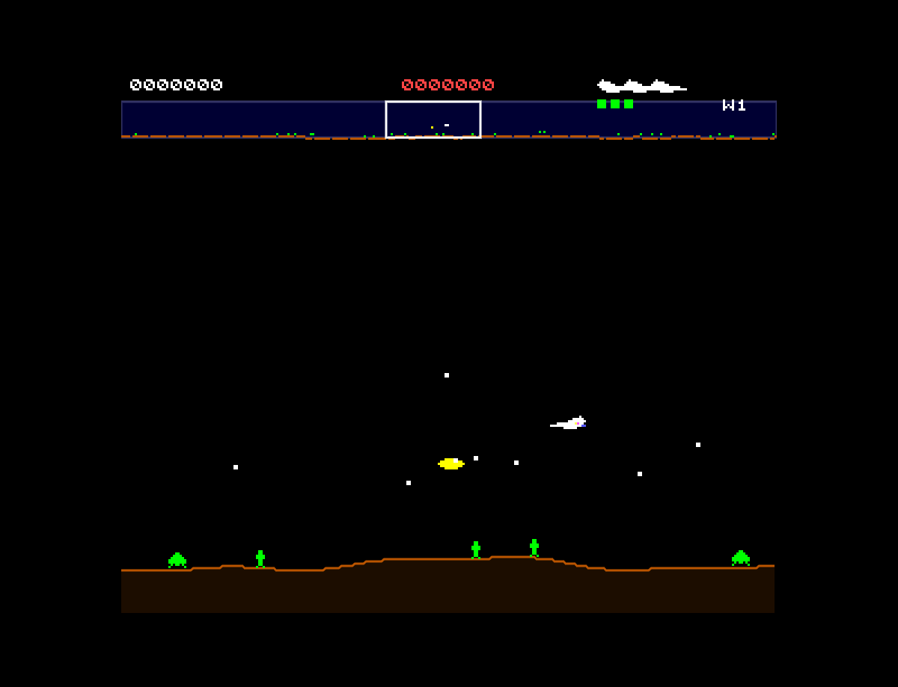

# Defender

A browser-based recreation of the classic 1981 Williams Electronics arcade game, built with vanilla JavaScript and HTML5 Canvas. Features a horizontally scrolling 2048-pixel world with wrap-around, a radar minimap scanner, six enemy types with distinct AI behaviors, humanoid rescue mechanics, and authentic procedural audio.

## How to Play

Open `index.html` in any modern browser. No build step or dependencies required.

### Controls

| Key | Action |
|-----|--------|
| Arrow keys | Move ship (up/down/left/right) |
| Space | Fire laser |
| D or Z | Smart bomb (destroys all on-screen enemies) |
| H | Hyperspace (random teleport — 25% death chance) |
| A | Reverse direction (without thrusting) |
| Shift | Thrust in current facing direction |
| Enter | Start game |

## Features

- Horizontally scrolling 2048-pixel world with seamless wrap-around
- Scanner/minimap strip showing all entities as color-coded dots
- 6 enemy types with distinct AI: Landers, Mutants, Baiters, Bombers, Pods, Swarmers
- Lander abduction sequence: descend, lock tractor beam, carry humanoid, transform to Mutant at top
- Humanoid rescue mechanics: catch falling humanoids mid-air for bonus points, deposit on terrain
- Planet destruction: all humanoids lost = planet explodes, all remaining Landers become Mutants
- Smart bombs: screen flash, all visible enemies destroyed
- Hyperspace: emergency escape with risk (25% instant death chance)
- Wave composition matching the original arcade (15 landers wave 1, scaling up)
- Baiter spawn timer: fast-tracking enemies appear when you take too long
- Particle-based explosion effects with color fade
- Extra life and smart bomb every 10,000 points
- Procedural audio: laser zaps, explosions, smart bomb blast, hyperspace warp, thrust hum
- Attract screen with cycling enemy showcase, controls display, and scrolling terrain

## Game History

Defender was designed by **Eugene Jarvis** and **Larry DeMar**, with hardware by **Sam Dicker**, and released by **Williams Electronics** in 1981. It is widely regarded as one of the most important and influential arcade games ever made.

### Origins

Jarvis was inspired by the Space Invaders phenomenon but wanted to create something fundamentally different — a game where you *defended* rather than attacked. The concept of rescuing humanoids from alien abduction gave the game a unique emotional stakes that pure shooters lacked. Development was famously chaotic: Jarvis coded the game with a broken hand (from a motorcycle accident) and the team had to fight Williams management who were skeptical about video games.

### The Hardware

Defender ran on a **Motorola 6809** processor with a custom Williams hardware platform displaying **292x240 pixels** using a **16-color palette** selected from 256 possible colors. The cabinet used a horizontal monitor orientation with an innovative control scheme: a 2-way joystick (up/down only) paired with **five buttons** (Thrust, Reverse, Fire, Smart Bomb, Hyperspace). This control scheme was considered overly complex at the time but became integral to the game's depth.

### Arcade Phenomenon

Despite initial skepticism about its difficulty and complex controls, Defender became one of the highest-grossing arcade games of the golden age. It sold over **55,000 cabinets** and generated approximately **$1 billion in quarters** during its lifetime. The game introduced several firsts to the medium:

- **Horizontal scrolling** — one of the first games with a playfield larger than the screen
- **Radar/minimap** — the scanner showing the entire world in compressed form
- **Complex enemy AI** — different enemy types with distinct behavioral patterns
- **Multi-objective gameplay** — shooting enemies AND rescuing humanoids simultaneously
- **Risk/reward mechanics** — hyperspace as a desperation move with real consequences

### Legacy

Defender spawned a direct sequel, **Stargate** (1981, also known as Defender II), and its DNA can be found in countless side-scrolling shooters that followed. The game was inducted into the **World Video Game Hall of Fame** and is consistently ranked among the greatest arcade games of all time. Eugene Jarvis went on to create Robotron: 2084, Blaster, and the Cruis'n series, but Defender remains his most celebrated work.

## Technical Details

This implementation is a single-file JavaScript game (`game.js`, ~2800 lines) organized into clearly separated sections:

1. **CONFIG** — All tunable constants (display, player physics, enemy speeds, scoring, wave composition, colors)
2. **Math Utilities** — World wrapping, shortest-distance calculation, world-to-screen conversion, AABB collision
3. **Sprite Data + Terrain + Font** — Pixel-art sprites for all entities, procedural terrain generator, bitmap font
4. **Sound Engine** — Procedural audio via Web Audio API (laser, explosions, smart bomb, hyperspace, thrust)
5. **Input Handler** — Keyboard state with just-pressed tracking for 7 game controls
6. **Entity Classes** — Player, Laser, Lander, Mutant, Baiter, Bomber, Mine, Pod, Swarmer, Humanoid, Bullet, Particle
7. **Collision System** — Player-vs-enemies, laser-vs-enemies, lander-capture, humanoid-rescue checks
8. **Renderer** — Scaled pixel-art rendering in 292x240 logical space at 3x, terrain, scanner minimap, HUD
9. **Game State Machine** — Attract, wave start, playing, player death, respawn, wave complete, game over, planet destroyed
10. **Main Loop** — Fixed 60Hz timestep with accumulator pattern

No external libraries or frameworks. Just HTML, CSS, JavaScript, and the Canvas and Web Audio APIs.

## License

This is a fan recreation for educational purposes. Defender is a trademark of Williams Electronics / Midway Games.
