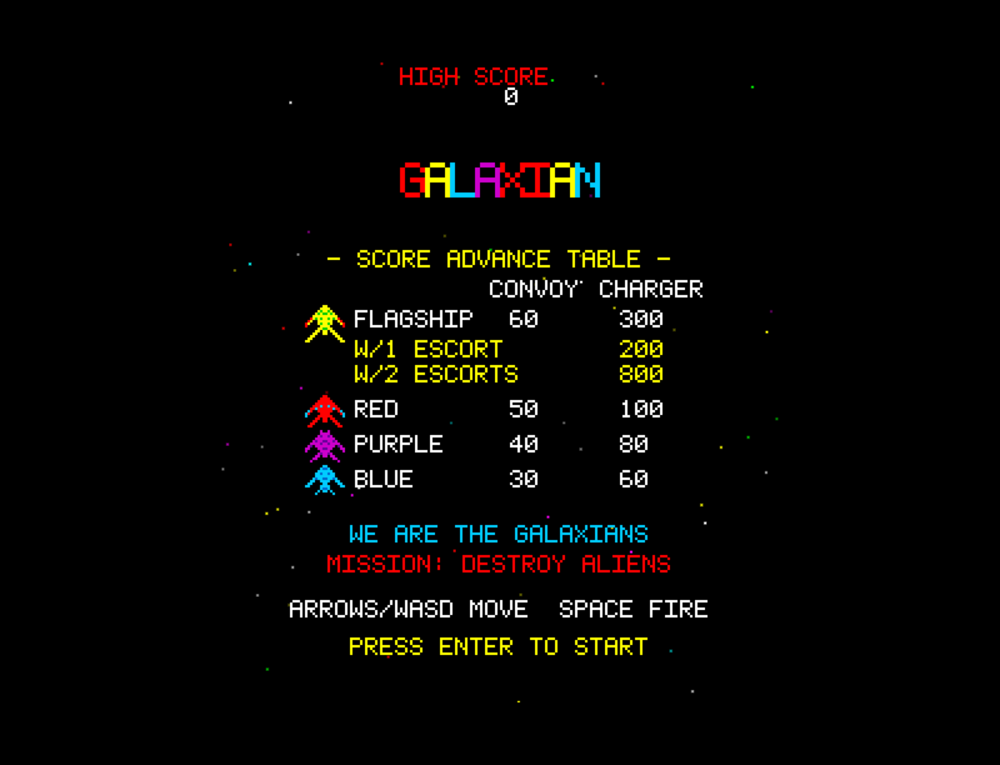
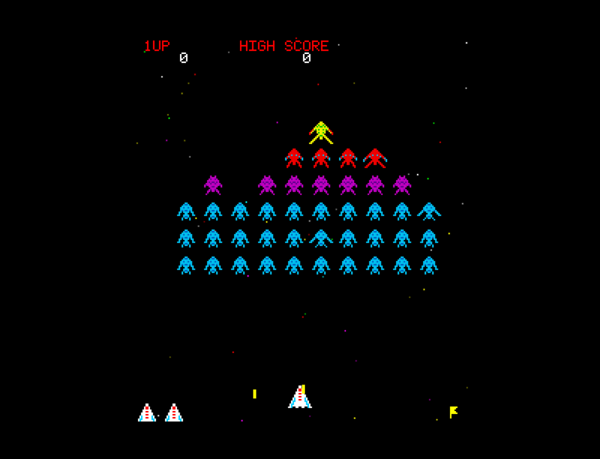

# Galaxian

A browser-based recreation of the classic 1979 Namco arcade game, built with vanilla JavaScript and HTML5 Canvas. Features a 46-alien formation with four distinct enemy types, dive-bombing bezier-curve attack patterns, flagship convoy mechanics with escort bonuses, scrolling starfield, and authentic procedural audio.

## How to Play

Open `index.html` in any modern browser. No build step or dependencies required.

### Controls

| Key | Action |
|-----|--------|
| Left/Right arrows or A/D | Move ship |
| Space | Fire (single shot — one bullet at a time) |
| Enter | Start game |

## Features

- 46 aliens in authentic formation: 2 flagships, 6 red escorts, 8 purple, 30 blue
- True RGB color — each alien type has distinct authentic colors (no cellophane overlay)
- Dive-bombing AI with smooth bezier-curve swooping attack paths
- Flagship convoy system: flagships recruit up to 2 red escorts for coordinated attacks
- Convoy scoring bonuses: 200 points with 1 escort killed, 800 with both escorts killed before flagship
- Swarm mode: when 5 or fewer aliens remain, all attack simultaneously
- Single-shot limitation — only one player bullet on screen at a time (authentic to original)
- Formation sway animation — aliens oscillate left and right as a group
- Scrolling multi-color starfield background
- Wave progression with increasing difficulty (faster dives, shorter intervals)
- Score table on attract screen showing each alien type with point values
- Wave flag indicators at bottom of screen
- Extra life at 7,000 points (one per game)
- Procedural audio: shooting, explosions, dive swoops, background drone with speed progression

## Game History

Galaxian was developed by **Namco** and released in **1979**, designed by a team led by **Kazunori Sawano**. It represented a major leap forward from Space Invaders and is considered a landmark in arcade game history.

### Origins

After the worldwide success of Taito's Space Invaders in 1978, Namco set out to create a game that would surpass it in every way. While Space Invaders featured a rigid grid of enemies that marched in lockstep, Galaxian introduced enemies that could break formation and attack individually with smooth swooping dive-bomb patterns. This was a revolutionary gameplay innovation that added unpredictability and excitement to the fixed-shooter genre.

### The Hardware

Galaxian ran on **Namco Galaxian hardware** using a **Zilog Z80** processor at 3.072 MHz. The display was **224x256 pixels** in **portrait orientation** — the same monitor configuration as Space Invaders, but with a critical difference: Galaxian was the **first arcade game to use true RGB color graphics**. While Space Invaders achieved color through cellophane overlays on a monochrome CRT, Galaxian rendered each sprite in its own distinct colors directly. The cabinet featured a vertical monitor with a joystick and single fire button.

### Arcade Phenomenon

Galaxian was a massive commercial success, becoming one of the highest-grossing arcade games of 1979-1980. It introduced several innovations that became standard in the genre:

- **True RGB color** — the first arcade game with multi-colored sprites rendered natively
- **Dive-bombing AI** — enemies that break formation and attack with curved flight paths
- **Flagship convoy mechanics** — boss enemies that recruit escorts for coordinated attacks
- **Bonus scoring system** — higher rewards for shooting enemies during their dangerous dive attacks
- **Scrolling starfield** — a cosmetic innovation that added depth and atmosphere

### Legacy

Galaxian's direct sequel, **Galaga** (1981), became even more famous and is one of the most beloved arcade games of all time. Galaga expanded on Galaxian's dive-bombing mechanics with dual-ship capture/rescue, more elaborate attack patterns, and bonus stages. The Galaxian hardware platform was used for numerous other Namco titles. The game was a foundational influence on the entire shoot-em-up genre and established Namco as one of the premier arcade game developers alongside Atari and Taito.

## Technical Details

This implementation is a single-file JavaScript game (`game.js`, ~2250 lines) organized into clearly separated sections:

1. **CONFIG** — All tunable constants (display, player, formation layout, scoring, dive AI, timing, colors)
2. **Math Utilities** — Clamp, lerp, bezier curve evaluation, rectangle overlap, angle calculation
3. **Sprite Data** — 16x16 pixel arrays for all alien types (2 animation frames each), player ship, explosions, bitmap font
4. **Sound Engine** — Procedural audio via Web Audio API (shooting, explosions, dive swoops, background drone)
5. **Input Handler** — Keyboard state with event-driven just-pressed detection
6. **Entity Classes** — Player, Bullet, Alien (with formation/diving/returning states), AlienBullet, Explosion, Star
7. **Collision System** — Player bullet vs aliens, alien bullets vs player, diving alien vs player
8. **Renderer** — Scaled pixel-art rendering in 224x256 logical space at 3x, sprite color maps, HUD, attract screen
9. **Game State Machine** — Attract, playing, player death, wave complete, game over with formation sway, dive AI, convoy logic
10. **Main Loop** — Fixed 60Hz timestep with accumulator pattern

No external libraries or frameworks. Just HTML, CSS, JavaScript, and the Canvas and Web Audio APIs.

## License

This is a fan recreation for educational purposes. Galaxian is a trademark of Namco / Bandai Namco Entertainment.
