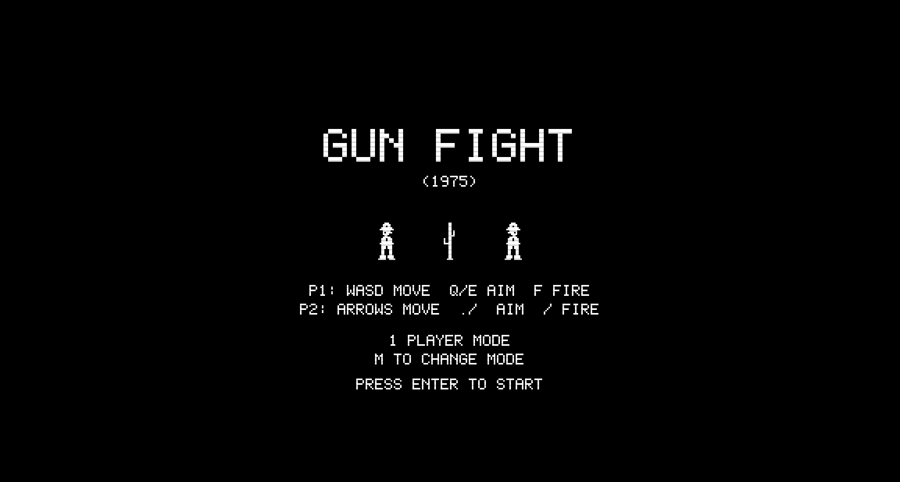
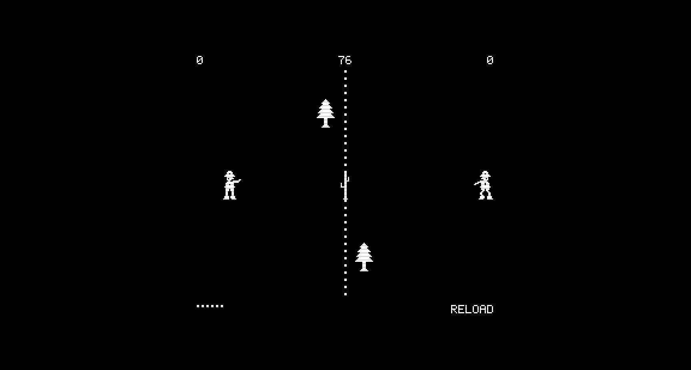

# Gun Fight

A browser-based recreation of Midway's **Gun Fight** (1975) — the first arcade game to use a microprocessor (Intel 8080). Two cowboys face off in a western duel, shooting around destructible obstacles. Features authentic monochrome pixel-art sprites, 7-position gun arm aiming, destructible cover, a moving stagecoach, and AI opponent for single-player mode.

## How to Play

Open `index.html` in any modern browser. No build step or dependencies required.

### Controls

**Player 1 (left cowboy):**

| Key | Action |
|-----|--------|
| W/A/S/D | Move up/left/down/right |
| Q | Aim gun up |
| E | Aim gun down |
| F | Fire |

**Player 2 (right cowboy):**

| Key | Action |
|-----|--------|
| Arrow keys | Move |
| , (comma) | Aim gun up |
| . (period) | Aim gun down |
| / (slash) | Fire |

**General:**

| Key | Action |
|-----|--------|
| Enter | Start game |
| M | Toggle 1P/2P mode |

In 1-player mode, you control the left cowboy while the AI controls the right.

## Features

- **7-position gun arm** — aim from -45° to +45° in ~15° steps, with visible arm and pistol sprites at each angle
- **Authentic cowboy sprites** — wide-brimmed hats with indented crown, facial profile silhouette, vest detail, gun belt with holster, pointed boots with heels
- **Destructible obstacles** — saguaro cacti (3 hits) and pine trees (5 hits) break down when shot
- **Moving stagecoach** — indestructible covered wagon bounces up and down the play field
- **6-bullet magazine** — each player carries 6 rounds, with 10-second auto-reload when empty
- **Bullet ricochets** — bullets bounce off top and bottom walls (up to 2 ricochets)
- **"GOT ME!" death text** — authentic kill confirmation displayed over fallen cowboy
- **New obstacle after each kill** — the battlefield gradually fills with cover
- **90-second rounds** — highest score when timer expires wins
- **AI opponent** — dodges incoming bullets, aims with slight inaccuracy, fires with variable timing
- **CRT scanline overlay** — authentic monochrome display with scanline effect
- **Procedural sound** — gunshots, ricochets, impacts, and reload sounds via Web Audio API

## Game History

Gun Fight was designed by **Tomohiro Nishikado** (creator of Space Invaders) at **Taito** as *Western Gun* in 1975. **Midway** licensed and modified it for the US market, replacing the discrete logic with an **Intel 8080 microprocessor** — making it the first arcade game to use a CPU.

### Historical Significance

Gun Fight was groundbreaking on multiple fronts:
- **First microprocessor-based arcade game** — the Intel 8080 at 1.9968 MHz replaced hundreds of discrete TTL logic chips, enabling far more complex game logic
- **First game with two on-screen human characters** battling each other
- **ROM-based graphics** — sprite data stored in ROM chips rather than generated by hardwired circuits, enabling detailed character graphics
- **Separate movement and aiming controls** — each player had a 4-way joystick for movement plus an analog pistol grip for aiming, a control scheme that presaged modern twin-stick shooters

### The Hardware

The original cabinet featured a 256×224 pixel black-and-white raster display with a yellow color overlay. Each player station had a 4-way joystick (left hand) and an analog pistol grip that tilted up/down to aim (right hand) with a trigger button. The round timer defaulted to 90 seconds but was adjustable to 60 seconds via DIP switches.

### Legacy

Gun Fight proved that microprocessor-based arcade games were commercially viable, paving the way for:
- **Space Invaders** (1978) — also by Nishikado, also on the 8080
- The entire **golden age of arcade games** — CPU-based hardware became standard
- **Competitive multiplayer games** — the face-off format influenced countless fighting and shooting games
- **Western-themed games** — from Boot Hill (1977) to Red Dead Redemption

## Technical Details

This implementation is a single-file JavaScript game (`game.js`, ~2000 lines) organized into 10 sections:

1. **CONFIG** — Display (256×224 at 3x), gameplay, timing, and AI constants
2. **Math Utilities** — Clamping, AABB collision, distance, angle calculations
3. **Sprite Data** — Cowboy body (2 walk frames), 7 gun arm positions, death pose, cactus, pine tree, stagecoach, bullet, and full 5×7 pixel font
4. **Sound Engine** — Procedural synthesis: gunshot, hit, ricochet, obstacle break, reload, round start, game over
5. **Input Handler** — Dual-player keyboard input with event-driven just-pressed buffer
6. **Entity Classes** — Cowboy (aim/fire/die/respawn), Bullet (ricochet), Cactus/Tree (destructible), Stagecoach (bouncing), AIController
7. **Collision System** — Bullet-cowboy, bullet-obstacle, bullet-wall (ricochet), cowboy-obstacle (blocking)
8. **Renderer** — Composite sprite rendering with horizontal mirroring for P2, dashed center divider, bullet indicators, HUD, attract/game-over screens
9. **Game State Machine** — attract → roundStart → playing → hit → roundEnd → gameOver cycle
10. **Main Loop** — Fixed 60Hz timestep with accumulator pattern

No external libraries or frameworks. Just HTML, CSS, JavaScript, and the Canvas and Web Audio APIs.

## License

This is a fan recreation for educational purposes. Gun Fight is a trademark of Midway Mfg. Co.
