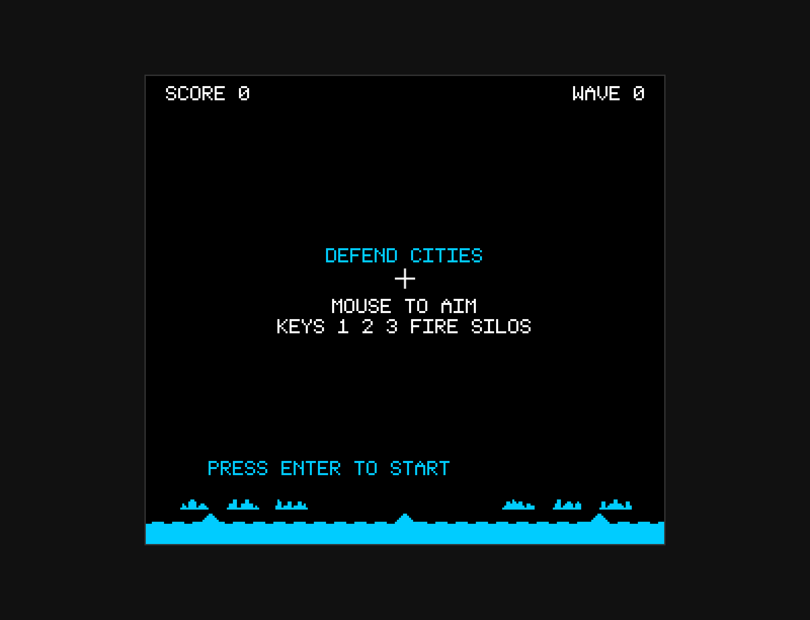
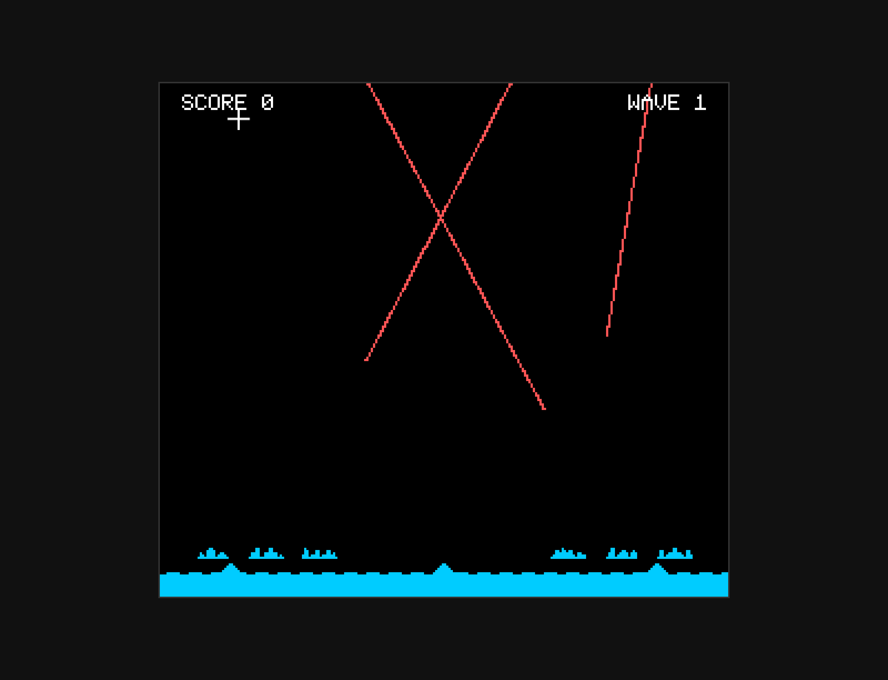

# Missile Command

A browser-based recreation of the classic 1980 Atari arcade game, built with vanilla JavaScript and HTML5 Canvas. Features mouse aiming with 3-key silo firing, persistent missile trails, octagonal explosions, wave-cycling color schemes, mountainous terrain, and authentic POKEY chip-era sound synthesis.

## How to Play

Open `index.html` in any modern browser. No build step or dependencies required.

### Controls

| Control | Action |
|---------|--------|
| Mouse | Aim crosshair |
| Key 1 | Fire from left silo (10 missiles) |
| Key 2 | Fire from center silo (10 missiles) |
| Key 3 | Fire from right silo (10 missiles) |
| Enter | Start game |

## Features

- Mouse-driven crosshair aiming with 1:1 position mapping
- Three anti-missile batteries with direct silo selection (keys 1/2/3)
- Persistent missile trails throughout each wave (authentic battle history network)
- Octagonal explosions using 3/8 slope scan-line algorithm (13px max radius)
- 10 wave-cycling color schemes matching authentic 3-bit RGB arcade palette
- Mountainous terrain with bumpy horizon profile
- 6 cities with distinct multi-story building skylines (4-6px tall sprites)
- 30 interceptors per wave (10 per silo), replenished each wave
- Progressive difficulty: missile count (2 + wave), speed (0.4 + 0.05×wave px/frame)
- Enemy types: ICBMs, MIRVs (split mid-flight), Smart Bombs (wave 3+), Bombers with mines (wave 5+), Satellites (wave 7+)
- Wave-based scoring with city survival bonuses and remaining ABM multipliers
- Procedural audio via Web Audio API (POKEY chip-style synthesis)
- Attract screen with ground layer preview and control instructions

## Game History

Missile Command was designed by **Dave Theurer** and released by **Atari** in July 1980. It became one of the most iconic and highest-grossing arcade games of the golden age, earning its place in video game history as both a technical achievement and a cultural touchstone during the Cold War era.

### Origins

Dave Theurer, who had previously worked on Atari's **Lunar Lander** vector game, wanted to create something with broader emotional resonance. Inspired by the ever-present nuclear threat of the late Cold War, he conceived a game where the player must defend cities from incoming ballistic missiles — a scenario that felt uncomfortably plausible to 1980 audiences. The game's original working title was "Armageddon."

The trackball control scheme was revolutionary for its time, allowing fast, precise aiming that felt natural and panic-inducing as waves intensified. Theurer later said he suffered nightmares during development about being unable to save cities from nuclear destruction.

### The Hardware

Missile Command ran on Atari's **6502-based hardware** with **256×231 pixel resolution** using a **3-bit RGB palette** (8 base colors with variations). The cabinet featured:

- **Trak-Ball controller** — fast analog control for crosshair positioning
- **Three fire buttons** — left, center, right (mapping to the three silos)
- **POKEY sound chip** — 4-channel audio for explosions, launches, and alerts
- **Raster display** — CRT monitor in cocktail or upright cabinet

The game's technical achievement was its **octagonal explosion collision detection**, implemented using clever bit-shifting and scan-line algorithms on the 6502 processor. Each explosion used a mathematically precise 3/8 slope geometry that created the distinctive non-circular blast radius.

### Arcade Phenomenon

Missile Command was an instant commercial success, selling over **20,000 cabinets** in its first year and generating approximately **$100 million in revenue**. The game resonated deeply with players who lived under the constant threat of nuclear war — every failed defense felt viscerally real.

The game introduced several firsts and innovations:

- **Trackball control** — one of the first arcade games to use trackball for aiming
- **Persistent visual history** — missile trails remained on screen throughout the wave
- **Multiple simultaneous threats** — up to 8 missiles on screen, forcing triage decisions
- **Unwinnable endgame** — "THE END" message after final city destruction (no continues)
- **Emotional stakes** — defending cities felt personal in the Cold War context

### Cultural Impact

Missile Command became more than a game — it was a mirror of Cold War anxiety. Players weren't saving abstract targets; they were defending humanity from annihilation. The game's famous finale, where all cities are destroyed and the screen displays "THE END," drove home the futility of nuclear war.

Dave Theurer reported having recurring nightmares where he couldn't save the cities, a testament to the psychological weight of the game's theme. The game has been preserved in the **Smithsonian American Art Museum** and inducted into the **World Video Game Hall of Fame** in 2015.

Missile Command spawned numerous sequels and ports: **Super Missile Attack** (Atari 2600), **Missile Command II** (arcade prototype), and modern reimaginings like **Missile Command: Recharged** (2020). Its influence can be seen in tower defense games, real-time strategy, and any game involving strategic resource management under pressure.

### Legacy

The game remains a touchstone for discussions about video games as art and social commentary. Its unwinnable nature and apocalyptic theme make it one of the few arcade games from the golden age to carry genuine philosophical weight. Designer Dave Theurer went on to create **Tempest** (1981) and **I, Robot** (1984), but Missile Command remains his most culturally significant work.

## Technical Details

This implementation is a single-file JavaScript game (`game.js`, ~2200 lines) organized into clearly separated sections:

1. **CONFIG** — All tunable constants (display resolution, missile speeds, scoring rules, wave progression, colors)
2. **Math Utilities** — Clamping, lerp, angle calculation, distance, AABB collision detection
3. **Sprite Data + Font** — Pixel-art sprites for cities, silos, bomber, satellite; terrain profile; bitmap font
4. **Sound Engine** — Procedural audio via Web Audio API (ABM launch chirp, explosions, siren, tallies)
5. **Input Handler** — Mouse position tracking, keyboard input with event-driven buffer, cursor hiding
6. **Entity Classes** — ABM, ICBM, SmartBomb, Explosion, EnemyBomb, Bomber, Satellite, City, Silo
7. **Collision System** — Explosion-vs-missiles, missiles-vs-cities, missiles-vs-silos, bombs-vs-structures
8. **Renderer** — Scaled pixel-art rendering in 256×231 logical space at 3×, terrain, persistent trails, octagonal explosions
9. **Game State Machine** — Attract, wave start, playing, wave complete, tally screen, game over
10. **Main Loop** — Fixed 60Hz timestep with accumulator pattern

No external libraries or frameworks. Just HTML, CSS, JavaScript, and the Canvas and Web Audio APIs.

## License

This is a fan recreation for educational purposes. Missile Command is a trademark of Atari, Inc.
