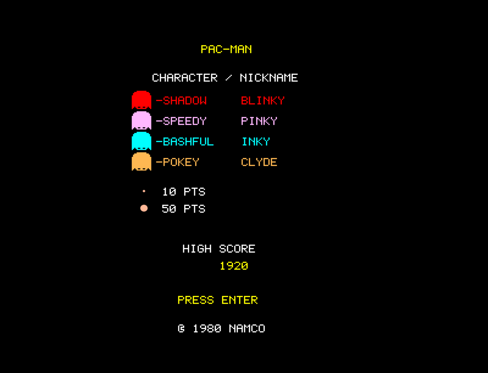
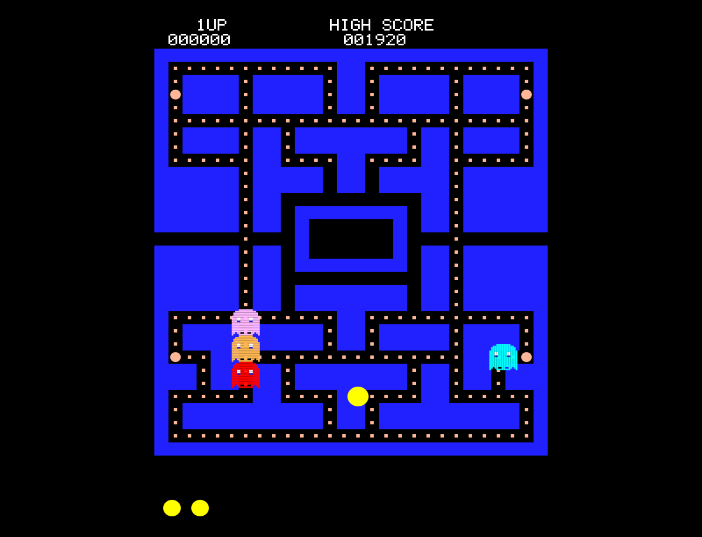

# Pac-Man

A browser-based recreation of the classic 1980 Namco arcade game, built with vanilla JavaScript and HTML5 Canvas. Features the iconic maze layout, four ghost characters with scatter/chase AI, power pellets, fruit bonuses, authentic death animation, and procedural audio including the signature wakka-wakka eating sound.

## How to Play

Open `index.html` in any modern browser. No build step or dependencies required.

### Controls

| Key | Action |
|-----|--------|
| Arrow keys or WASD | Move Pac-Man |
| Enter | Start game / Restart |

## Features

- Classic 28×31 tile maze with symmetrical design, central ghost house, and side tunnels
- Four ghosts with distinct colors — Blinky (red), Pinky (pink), Inky (cyan), Clyde (orange)
- Scatter/chase mode cycling with per-ghost targeting AI
- Power pellets turn ghosts blue and vulnerable — combo scoring: 200, 400, 800, 1600
- Percentage-based speed system matching the original arcade (Pac-Man 80%, ghosts 75%, frightened 50%)
- Frame pause on dot eating (1 frame per dot, 3 frames per power pellet)
- Fruit spawning — cherry, strawberry, orange, apple with authentic 13×13 sprites
- Three-phase death animation: 30-frame freeze, 60-frame directional spin, 30-frame collapse
- Tunnel wraparound with reduced ghost speed in tunnel zones
- Direction buffering for smooth cornering at intersections
- Procedural audio via Web Audio API — 4-bit quantized wakka-wakka, power pellet siren, ghost eaten jingle, death sound
- Attract screen with ghost character introductions and point values
- High score persistence via localStorage
- Extra life every 10,000 points
- 1UP and HIGH SCORE HUD displayed cleanly above the maze

## Game History

### Origins

Pac-Man was created by **Toru Iwatani** and released by **Namco** in Japan on May 22, 1980. Iwatani designed the game to appeal to a broader audience beyond the typical shoot-'em-up arcade games of the era, aiming to attract female players and couples to arcades. The character's iconic shape was inspired by a pizza with a slice removed. The original Japanese name "Puck-Man" (from the Japanese *paku-paku*, an onomatopoeia for eating) was changed to "Pac-Man" for the North American release by Midway to prevent vandalism of arcade cabinets.

### The Hardware

The original arcade cabinet ran on a **Namco 8-bit PCB** featuring a **Zilog Z80A** processor at 3.072 MHz, displaying **224×288 pixels** in portrait orientation using a **16-color palette**. The maze was rendered via an **8×8 tile system** (28×36 grid) with six **16×16 hardware sprites** for Pac-Man and the ghosts. A custom **3-voice waveform generator** (the Namco WSG) produced all sound effects and the distinctive siren — no sampled audio, purely synthesized waveforms.

### Arcade Phenomenon

Pac-Man became one of the highest-grossing arcade games of all time, generating over **$1 billion in quarters** in the United States alone by 1982. It transcended gaming to become a cultural icon — spawning merchandise, an animated television series, a top-ten hit single ("Pac-Man Fever" by Buckner & Garcia), and dozens of sequels and spin-offs. The four ghost characters each had distinct AI personalities that gave the game surprising depth:

- **Blinky** (Shadow) — directly chases Pac-Man, speeds up as dots are eaten (Cruise Elroy)
- **Pinky** (Speedy) — targets 4 tiles ahead of Pac-Man's current direction
- **Inky** (Bashful) — uses a complex vector calculation involving Blinky's position
- **Clyde** (Pokey) — chases when far away, scatters when within 8 tiles

### Legacy

Pac-Man has been recognized by Guinness World Records as the "Most Successful Coin-Operated Arcade Game" and remains one of the longest-running video game franchises. It has been ported to virtually every gaming platform ever made. In 2010, Google celebrated Pac-Man's 30th anniversary with a playable Google Doodle. The game's maze-chase mechanics, power-up system, and character-driven enemy AI influenced countless games that followed, from Ms. Pac-Man to modern roguelikes.

## Technical Details

This implementation is a single-file JavaScript game (`game.js`, ~2,370 lines) organized into clearly separated sections:

1. **CONFIG** — All tunable constants (display, timing, speeds, scoring, colors)
2. **Math Utilities** — Grid/pixel conversion, collision detection, Manhattan distance, world wrapping
3. **Sprite Data** — Pac-Man, ghost, fruit, eyes, and font sprites as 2D number arrays
4. **Sound Engine** — Procedural audio via Web Audio API (4-bit wakka waveform, siren, jingles)
5. **Input Handler** — Keyboard state with event-driven buffer for frame-perfect input
6. **Entity Classes** — PacMan and Ghost with movement, AI targeting, and mode management
7. **Collision System** — Wall, dot, power pellet, fruit, and ghost collision detection
8. **Renderer** — Scaled pixel-art rendering with ctx.translate for HUD/maze separation
9. **Game State Machine** — Attract, ready, playing, death animation, game over, maze parsing, scoring
10. **Main Loop** — Fixed 60Hz timestep with accumulator pattern

No external libraries or frameworks. Just HTML, CSS, JavaScript, and the Canvas and Web Audio APIs.

## License

This is a fan recreation for educational purposes. Pac-Man is a registered trademark of Bandai Namco Entertainment.
