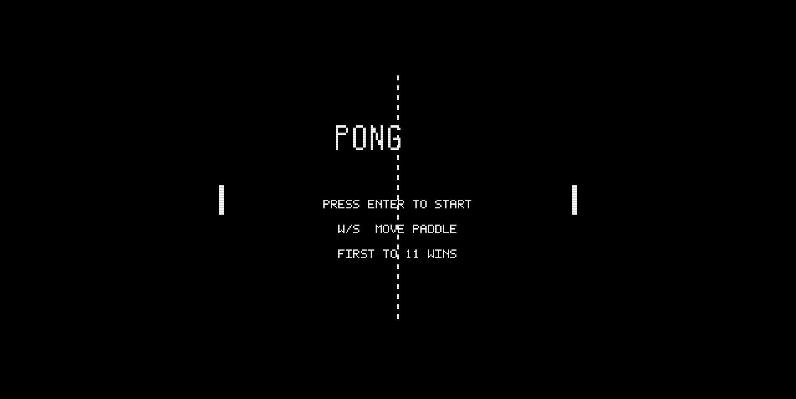
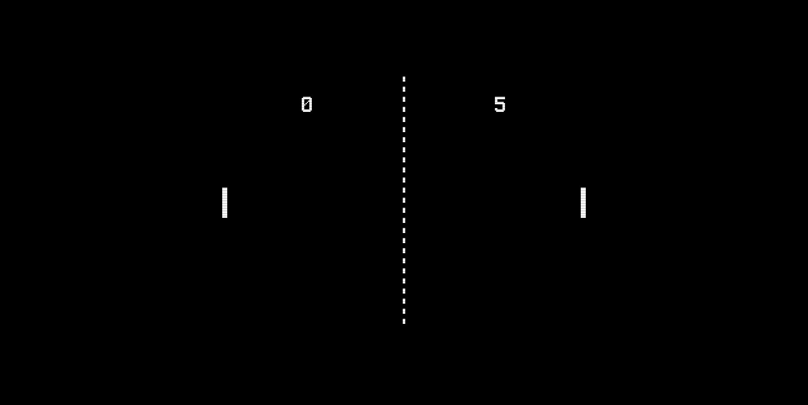

# Pong

A browser-based recreation of the original 1972 Atari arcade game — the first commercially successful video game. Features authentic 8-segment paddle deflection, progressive ball acceleration, monochrome CRT-style visuals with scanline effects, and procedural square wave audio matching the original hardware tones.

## How to Play

Open `index.html` in any modern browser. No build step or dependencies required.

### Controls

| Key | Action |
|-----|--------|
| W / Arrow Up | Move paddle up |
| S / Arrow Down | Move paddle down |
| Enter | Start game |

You control the left paddle. The right paddle is controlled by the computer.

## Features

- 8-segment paddle deflection — ball angle changes based on where it hits the paddle (center returns flat, edges return steep)
- Progressive ball acceleration — ball gets faster with each paddle hit, resets on score
- Square ball — authentic 4x4 pixel square, not a circle
- Monochrome display — pure white on black matching the original CRT TV output
- Dashed center net — evenly spaced vertical dashes
- 3 distinct sound effects — paddle hit (459 Hz), wall bounce (226 Hz), and score (490 Hz) as square wave beeps
- Large 7-segment style score display at top of screen
- Game to 11 — first player to 11 points wins
- Constant horizontal ball speed — only vertical component changes with deflection angle
- Serve alternation — after a score, ball serves toward the scored-upon player
- AI opponent with reaction distance and dead zone for natural-looking play
- CRT scanline overlay effect for authenticity

## Game History

Pong was designed by **Allan Alcorn** and released by **Atari, Inc.** in November 1972. It was the first commercially successful video game and launched the video game industry.

### Origins

Atari founder **Nolan Bushnell** hired Allan Alcorn, a recent UC Berkeley graduate, and assigned him Pong as a training exercise — a simple electronic tennis game inspired by the table tennis game in the Magnavox Odyssey. Alcorn exceeded expectations, adding scoring, sound effects, and the angled ball return that made the game compelling. Bushnell recognized its potential and decided to manufacture it.

### The Hardware

Pong was unique among early video games because it had **no CPU and no software** — the entire game was built from approximately 66 TTL (Transistor-Transistor Logic) chips wired together on a circuit board. The ball position, paddle tracking, collision detection, scoring, and even the sound effects were all produced by discrete logic circuits. The display was a standard black-and-white television set. Each player controlled their paddle with a rotary knob (potentiometer) that provided smooth analog movement.

### Arcade Phenomenon

Atari installed the first Pong prototype at **Andy Capp's Tavern** in Sunnyvale, California in late 1972. Within days, the machine broke down — because the coin box had overflowed. This confirmed the game's commercial viability. Atari went on to manufacture over **8,000 Pong cabinets**, and the game's success spawned an entire industry of imitators, with numerous companies producing their own Pong clones throughout the mid-1970s.

### Legacy

Pong established video games as a viable commercial entertainment medium. It directly led to:
- The **home console market** — Atari's Home Pong (1975) was a massive retail success
- The **arcade industry boom** — Pong proved coin-operated video games could be profitable
- **Atari's dominance** — the company went on to create Breakout, Asteroids, and the Atari 2600
- **Game design fundamentals** — the concept of simple rules creating deep gameplay, progressive difficulty through ball acceleration, and competitive two-player mechanics

Pong was inducted into the **World Video Game Hall of Fame** in 2015.

## Technical Details

This implementation is a single-file JavaScript game (`game.js`, ~1180 lines) organized into clearly separated sections:

1. **CONFIG** — All tunable constants (display, physics, scoring, timing)
2. **Math Utilities** — Clamping, sign, and AABB collision helpers
3. **Sprite Data** — 7-segment digit bitmaps (8x12) for score display
4. **Sound Engine** — Procedural square wave synthesis via Web Audio API (3 distinct tones)
5. **Input Handler** — Keyboard state management with just-pressed tracking
6. **Entity Classes** — Paddle, Ball, and AIController
7. **Collision System** — 8-segment paddle deflection, wall bouncing, and scoring detection
8. **Renderer** — Scaled pixel-art rendering in 320x200 logical space at 3x magnification with CRT scanlines
9. **Game State Machine** — Attract, serving, playing, scored, and game-over states
10. **Main Loop** — Fixed 60Hz timestep with accumulator pattern

No external libraries or frameworks. Just HTML, CSS, JavaScript, and the Canvas and Web Audio APIs.

## License

This is a fan recreation for educational purposes. Pong is a trademark of Atari, Inc.
